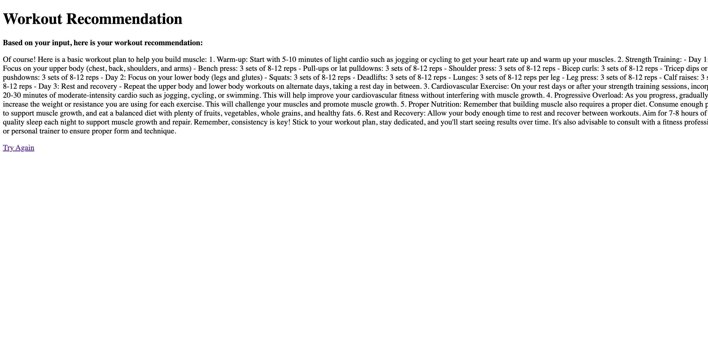
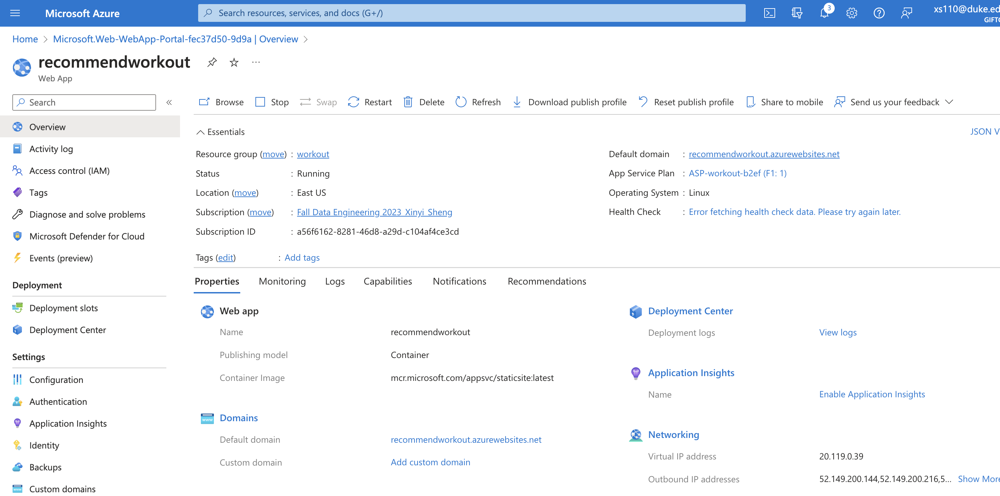

# Individual Project 4: Auto Scaling Flask App Using Any Serverless Platform

## Workout Recommendation Flask App Using ChatGPT API

## Project Overview
This project involves creating a web-based application designed to provide personalized workout plans using the advanced capabilities of the ChatGPT API and user-friendly interface. 

## Features

* Personalized Recommendations: Generate workout plans tailored to individual user profiles.
* ChatGPT Integration: Utilize advanced natural language processing for insightful advice.
* User-Friendly Interface: Simple and intuitive design for ease of use.
Dependencies
List all the necessary dependencies and their versions, such as Flask, Docker, any libraries used for interacting with the ChatGPT API, etc.

## Installation and Setup

   
1. Set Up the Environment: 
Install necessary libraries: flask, requests,openai.
2. Integrate ChatGPT API:
Access to the OpenAI API (which includes ChatGPT). Get the API key from OpenAI.
3. Create the Flask Application:
Write a Flask app with a simple frontend to input user details (gender, age, goal) in `main.py`. Use the LLM ChatGPT API to generate workout recommendations based on the input. 
* key setup: create two html in templates folder, chatgpt api and required packages.

## Running the Flask app
Here is the link to the app:

In the web app, you will see this page,

if you enter 18 and choose More muscle, the click `get recommentation` button, you should wail a few seconds, the app will give you workout recommentations based on your input

## Deployment
To make the project easy to deploy, it is containerized with docker. I create a web app container, then uploaded a docker image in docker hub. 

* Web app

1. login Azure`az login`
2. webapp `az containerapp up --resource-group Myresource --name recommendationworkout --ingress external --target-port 8000 --source .`
* Dockerhub

1. login to Docker Hub in terminal `docker login --username <username>`

2. build docker image:`docker build -t <username>/repo .`
3. tag the image:`docker tag repo <username>/repo`
4. Push the image to Docker Hub: `docker push <username>/repo`

## Video Demo

